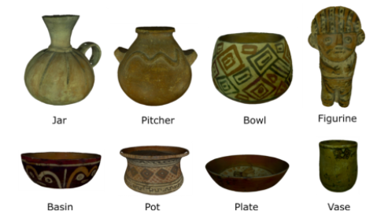
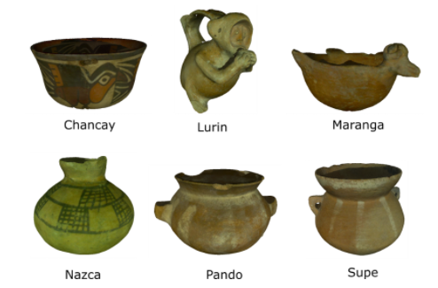
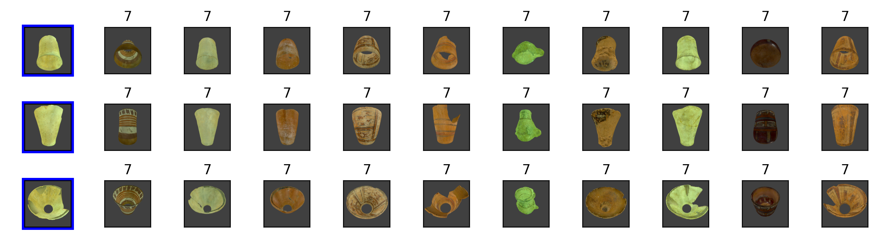
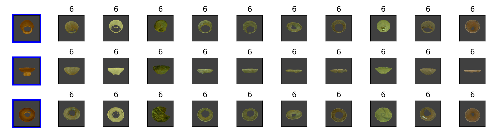

# 3D Mesh Object Classification and Retrieval 

- This code is for HCMUS-TEAM at SHREC 2021: Retrieval of Cultural Heritage Objects
- Challenge link: http://www.ivan-sipiran.com/shrec2021.html

## Datasets
| Task Shape | Task Culture |
|:-------------------------:|:-------------------------:|
| |  | 

### Mesh Simplification

*From left to right: Original (~40k faces) | 20k faces | 10k faces | 5k faces*

## Metric Descriptions
Name | Description
--- | --- 
Mean Average Precision (**MAP**) |  Given a query, its average precision is the average of all precision values computed in each relevant object in the retrieved list. Given several queries, the mean average precision is the mean of average precision of each query.
Nearest Neighbor (**NN**) | Given a query, it is the precision at the first object of the retrieved list.
First Tier (**FT**) | Given a query, it is the precision when C objects have been retrieved, where C is the number of relevant objects to the query.
Second Tier (**ST**) | Given a query, it is the precision when 2*C objects have been retrieved, where C is the number of relevant objects to the query.
Normalized Discounted Cumulative Gain (**NDCG**) | DCG measures the usefulness, or gain, of a document based on its position in the result list. The gain is accumulated from the top of the result list to the bottom, with the gain of each result discounted at lower ranks.

## Results on testset

### Task Shape
Model | MAP | NN | FT | ST | NDCG
--- | --- | --- | --- | --- | ---
MeshNet (ensemble) | 0.791 | 0.836 | 0.917 | 0.852 | 0.926

### Task Culture
Model | MAP | NN | FT | ST | NDCG
--- | --- | --- | --- | --- | ---
MeshNet (ensemble) | 0.725 | 0.742 | 0.735 | 0.741 | 0.835 

### Vizualization

